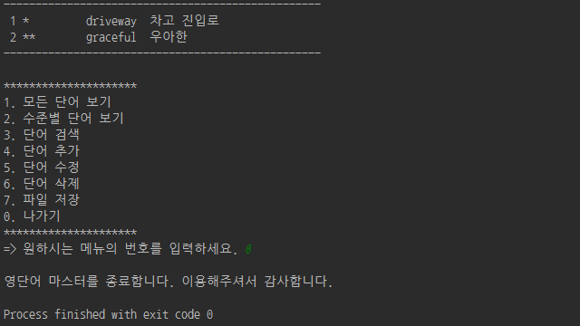

# WordMasterProject
## Project 1 - Phase 1
- <b>[4. 단어 추가]</b> 메뉴 실행 화면  
</img>  
</img>  
- <b>[1. 모든 단어 보기]</b> 메뉴 실행 화면  
</img>  
- <b>[0. 나가기]</b> 메뉴 실행 화면  
</img>  
## Project 1 - Phase 2
- <b>[2. 수준별 단어 보기]</b> 메뉴 실행 화면  
</img>  
- <b>[3. 단어 검색]</b> 메뉴 실행 화면  
</img>  
- <b>[5. 단어 수정]</b> 메뉴 실행 화면  
</img>  
- <b>[6. 단어 삭제]</b> 메뉴 실행 화면  
</img>  
- <b>[7. 파일 저장]</b> 메뉴 실행 화면  
</img>  
- 단어장 파일 ('mediate' 단어 삭제 전)  
</img>  
- 단어장 파일 ('mediate' 단어 삭제 후)  
</img>  
- 파일 로딩, <b>[1. 모든 단어 보기]</b> 메뉴 실행 화면  
</img>  
</img>  
